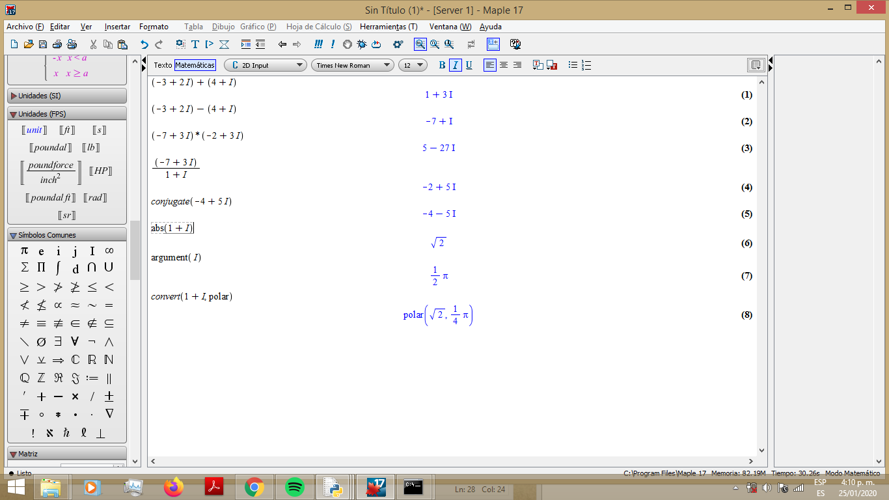

# Curso CNYT Ciencias naturales y tecnologia
## Proyecto: Complejos
## Proyecto#: 1
## Programador: 
## Edgar Ronaldo Henao Villarreal

### Contenido
__Esenciales__
- Sumar
- Restar
- Multiplicar
- Dividir
- Conjugado
- Modulo
- Fase de un complejo
- Pasar a polar
- Pasar a cartesianas

__Opcionales__
- Separar
- Mostrar

#### Pruebas
Los calculos se hicieron con el software 
``` 
maple17 
```
La imagen 
da constancia de los resultados, estos a su vez
se realizan en ```test_case.py``` donde se evidencia un correcto funcionamiento de 
la libreria.

#### ¿Como usar la libreria?
Con la instruccion en ```python 3.*```:
```import complejos```.

__Nota:__ Para visualizar la documentacion [haga click aqui](http://htmlpreview.github.io/?https://github.com/ronis97/CNYT-grupo1/blob/master/HTML/complejos.html).
