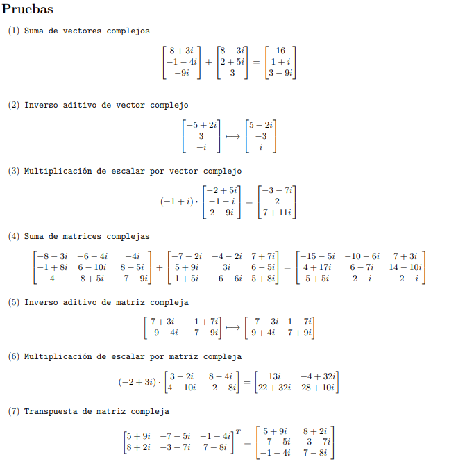
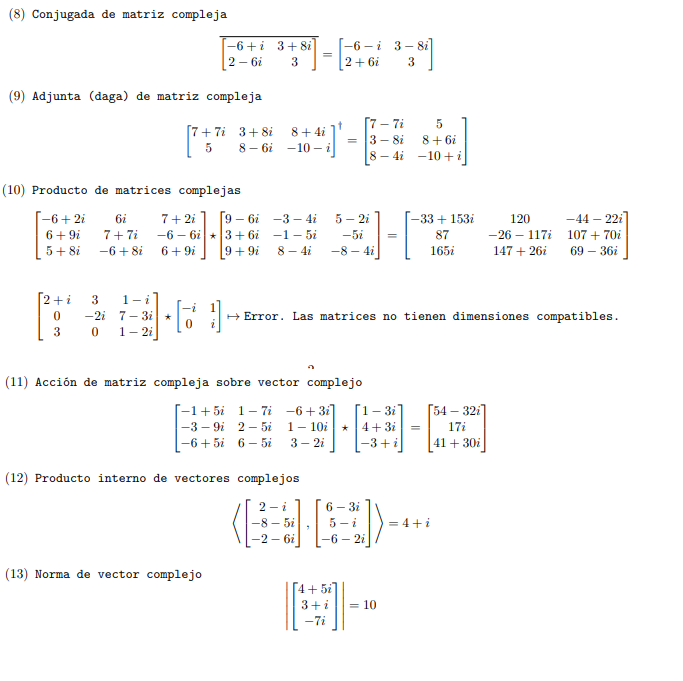
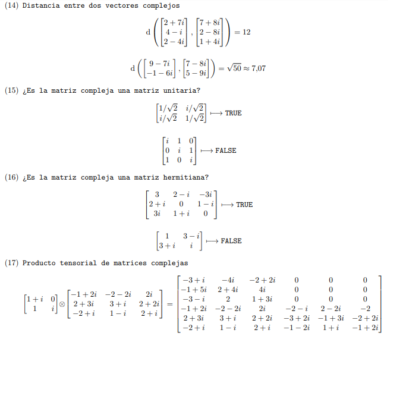
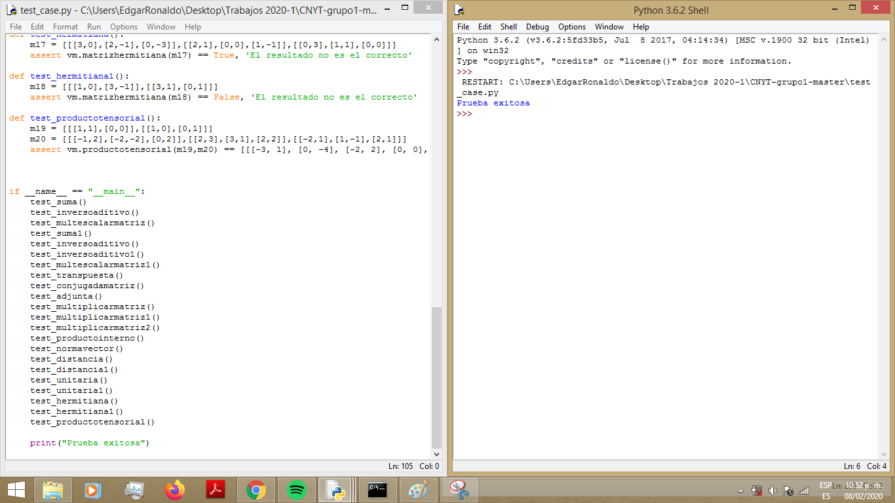

# CNYT Ciencias naturales y tecnología
## 2 Libreria de funciones (operaciones con vectores y matrices complejas)
### Fecha: 09 de Febrero de 2020
### Contribuidor: Edgar Ronaldo Henao Villarreal
### Contenido
- generar
- generar identidad
- sumamatriz
- restamatriz
- multiplicarmatriz
- mostrar
- inverso aditivo de matriz
- multiplicar escalar por matriz
- transpuesta
- conjugada matriz
- adjunta matriz
- producto interno
- normavector
- distancia de vectores
- matriz hermitiana
- truncar
- matriz unitaria
- producto tensorial

La documentacion de cada funcion se puede encontrar [aca](http://htmlpreview.github.io/?https://github.com/ronis97/LibreriaMatricesVectoresINComplejos/blob/master/HTML/vectmatrices.html).

Las pruebas se encuentran en `test_case.py`. Las imagenes respectivas que lo demuestran son:

De esta manera, ejecutamos `test_case.py` y encontramos:

# Uso de Libreria
Para usar esta libreria solo basta con descargar los archivos `complejos.py` y `vectmatrices.py` ubicarlos
en la carpeta del proyecto en el que se vayan a utilizar y escribir en `python 3.*` las dos sencillas instrucciones:

`import complejos`

`import vectmatrices`
